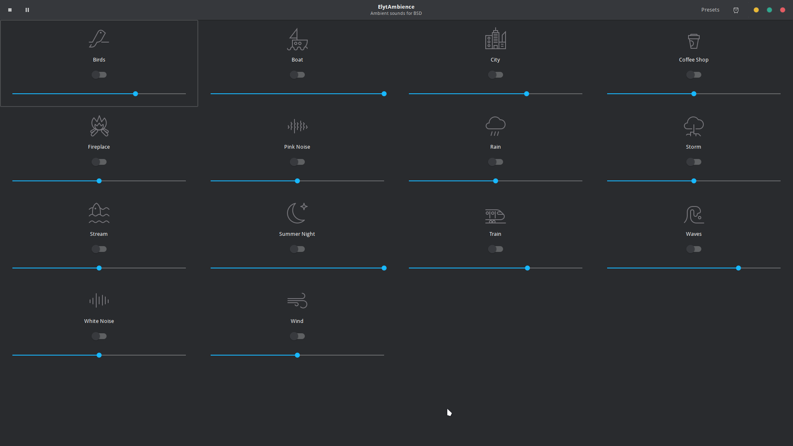
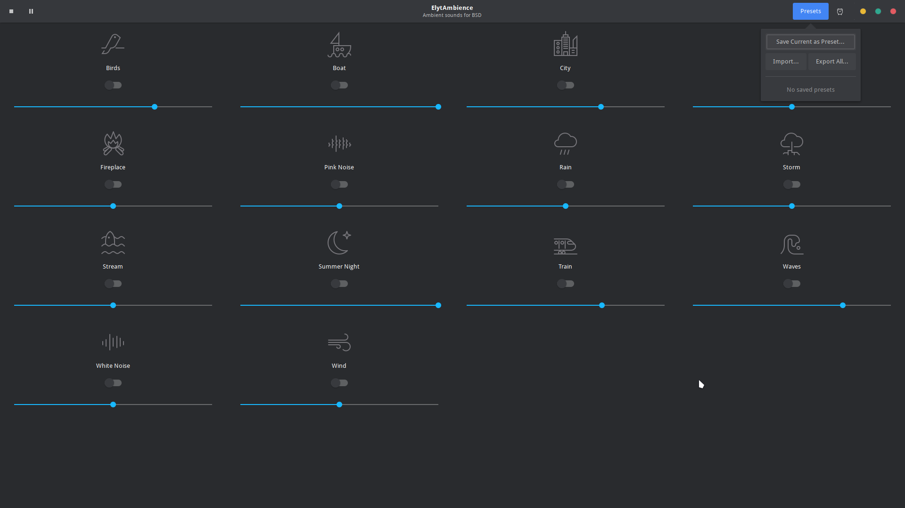

# 🍃 ElytAmbience

**ElytAmbience** is a native ambient sound generator built for the BSD desktop. It is a high-performance rewrite of the popular [Blanket](https://github.com/rafaelmardojai/blanket) application, specifically optimized for **FreeBSD** and **GhostBSD**.




---

### ✨ Features
*   **🚀 Native Performance:** Built using GTK3 and GStreamer for a lightweight, efficient experience.
*   **🎧 Immersive Sounds:** Includes 14 atmospheric loops (Rain, Storm, City, etc.) with individual volume sliders.
*   **💾 Persistence:** Automatically remembers your active sounds and volume levels between sessions.
*   **📂 Presets:** Save, load, import, and export your favorite soundscapes easily.
*   **⏲️ Sleep Timer:** Set a countdown timer to automatically pause playback, featuring a live countdown display.
*   **🎵 MPRIS Integration:** Control playback via media keys, system applets, and D-Bus.
*   **🎨 MATE Integration:** Designed to look and feel right at home on the MATE Desktop Environment.
*   **📥 Background Playback:** Hides to the system tray so you can focus on your work while it plays.

---

### 📦 Installation

#### From Binary (Recommended for GhostBSD/FreeBSD)
Install the latest version using:
```bash
sudo pkg add https://github.com/elytraVIII/ElytAmbience/releases/latest/download/elytambiance-freebsd.pkg
```

#### From Source
Ensure you have the build dependencies installed (`meson`, `ninja`, `python3.11`, `py311-pygobject`, `gstreamer1-plugins-good`, `gstreamer1-plugins-ogg`, `gstreamer1-plugins-vorbis`).

```bash
# Setup the build directory
meson setup build

# Compile the application
meson compile -C build

# Install system-wide
sudo meson install -C build
```

---

### 📜 Credits & Licensing
ElytAmbience is a rewrite of the [Blanket](https://github.com/rafaelmardojai/blanket) application by Rafael Mardojai CM and contributors. We are grateful for their work and for providing the high-quality sounds and icons used in this project.

*   **Sounds:** See [SOUNDS_LICENSING.md](SOUNDS_LICENSING.md) for detailed attribution and licenses.
*   **Icons:** Sourced from the Blanket project (GPL-3.0).
*   **Contributing:** Want to add new sounds? Check out our [CONTRIBUTING.md](CONTRIBUTING.md).

---
*Developed by ElytLabs. Bringing essential tools to the BSD desktop.*
